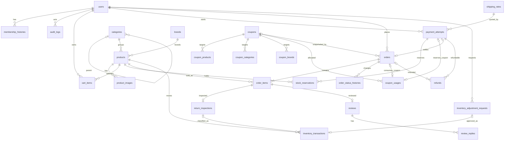

# 07 — Thiết kế cơ sở dữ liệu triển khai

Tài liệu này là thiết kế cho MariaDB/MySQL. Các migration `users`, Category, Brand, Product/Image, Inventory/Audit, `cart_items`, `payment_attempts`, `stock_reservations`, `orders`, `order_items` và `order_status_histories` đã triển khai; các bảng nghiệp vụ còn lại vẫn là kế hoạch. Baseline Laravel có `users`, `password_reset_tokens`, `sessions`, cache và queue mặc định. Đề xuất **24 bảng nghiệp vụ mới và mở rộng `users`**; không tạo bảng `payments` riêng: `payment_attempts` là hồ sơ giao dịch VNPay, còn `orders.payment_status` là trạng thái thanh toán của đơn (COD hoặc VNPay). Kho phiên bản đầu chỉ có một địa điểm nên không cần bảng `warehouses`.

## Quy ước và nguyên tắc

- Dùng InnoDB, `utf8mb4`; khóa chính `BIGINT UNSIGNED` tăng dần. Tiền VND dùng số nguyên, không dùng float; mặc định là `BIGINT UNSIGNED`. Riêng `shipping_rates.fee_vnd` dùng signed `BIGINT` kèm CHECK `>= 0` để MariaDB non-strict không thể ép đầu vào âm thành `0` trước khi CHECK đánh giá. Số lượng là `INT UNSIGNED`, chênh lệch kho là `INT` có dấu. Tổng tiền được tính bằng số nguyên ở server.
- Lưu mốc thời gian bằng `DATETIME(6)` UTC; chuyển sang `Asia/Ho_Chi_Minh` khi hiển thị. `expires_at` và cửa sổ 90/7 ngày so trên UTC. Không dùng giờ địa phương làm khóa hoặc tính hết hạn. `created_at`, `updated_at` mặc định do ứng dụng cấp UTC, không dựa vào múi giờ session SQL.
- Chọn `VARCHAR` + PHP backed enum/validation cho các trạng thái đã chốt; không dùng SQL `ENUM` vì thêm giá trị SQL ENUM đòi đổi schema và thứ tự nội bộ. Dùng DB `CHECK` cho số không âm, khoảng rating/discount và giá trị trạng thái trên phiên bản MariaDB/MySQL hỗ trợ CHECK đúng nghĩa; luôn lặp lại validation trong ứng dụng. Trước migration cần kiểm tra phiên bản DB thực tế.
- Ký hiệu từ điển: `!` = NOT NULL, không có default trừ khi ghi `=...`; `?` = NULL, default NULL; `=x` = NOT NULL, default x. Mỗi bảng nghiệp vụ có `id BIGINT UNSIGNED AUTO_INCREMENT PK`, `created_at DATETIME(6)!`, `updated_at DATETIME(6)!`, trừ bảng lịch sử/log chỉ có `created_at`, bảng nối chỉ có khóa ghép và nơi ghi chú khác. Các cột thời gian nullable đều ghi `?` rõ ràng. Không ngầm định default cho cột `!`.
- Không lưu tổng có thể tính tùy tiện. `products.sellable_quantity`, `damaged_quantity`, `sold_quantity` là **projection giao dịch** để khóa và đọc nhanh, cập nhật cùng transaction với `inventory_transactions`/chuyển `da_giao`; có tác vụ đối soát từ sổ giao dịch. `available = sellable_quantity - SUM(reservations còn hiệu lực)` tính khi truy vấn dưới khóa, không lưu. `orders` giữ tổng và snapshot vì cần lịch sử kế toán; `users.current_tier` và `users.membership_spending` là projection từ đơn đã giao chưa full refund, không tính shipping; có lịch sử hạng và phép tính lại. Cả hai chỉ được cập nhật qua nghiệp vụ/tính lại có audit.
- Không hard delete order, item, payment, refund, inventory, coupon usage, review history, audit. FKs dùng `RESTRICT` cho dữ liệu giao dịch, `SET NULL` chỉ khi danh tính tác nhân phụ trợ được phép biến mất; không cascade xóa lịch sử. Mọi FK dùng `ON UPDATE RESTRICT` vì ID không được đổi.

## ERD



`password_reset_tokens.email` của Laravel là khóa logic tới email user, **không tạo FK** vì email có thể đổi; `sessions.user_id` hiện không có FK trong migration mặc định. Hai bảng này không thuộc 24 bảng mới. ERD bỏ bớt các FK tác nhân phụ để dễ đọc; danh sách đầy đủ ở dưới.

## Từ điển dữ liệu

### Tài khoản và catalog

| Bảng và mục đích | Cột riêng (ngoài `id`, timestamps chung) | Khóa/ràng buộc, xóa và snapshot |
| --- | --- | --- |
| `users` — tài khoản, mở rộng migration Laravel | Giữ `name VARCHAR(255)!`, `email VARCHAR(255)!`, `email_verified_at TIMESTAMP?`, `password VARCHAR(255)!`, `remember_token VARCHAR(100)?`, `created_at TIMESTAMP?`, `updated_at TIMESTAMP?` đúng migration Laravel hiện có; thêm `phone VARCHAR(20)?`, `gender VARCHAR(3)?`, `dob DATE?`, `address TEXT?`, `role VARCHAR(16)!=customer`, `status VARCHAR(16)!=active`, `current_tier VARCHAR(16)!=dong`, `membership_spending BIGINT UNSIGNED!=0`, `last_login_at TIMESTAMP?`, `must_change_password BOOLEAN!=0`. Tên `current_tier` giữ theo thiết kế này thay cho `membership_level` trong yêu cầu slice. | `UQ(email)` sẵn có, thêm `UQ(phone)`; index role/status/current_tier. Gender chỉ `nam`/`nu`, ngày sinh không ở tương lai kiểm tra tại ứng dụng; spending không âm. Slice đăng ký dùng enum cast, default và validation ứng dụng; migration `add_user_domain_checks_to_users_table` đã bổ sung sáu CHECK role/status/current_tier, gender, membership_spending và must_change_password. Không tự đăng ký employee/admin; không khóa/hạ quyền admin cuối dưới khóa hàng admin. Không hard delete khi đã phát sinh dữ liệu. `current_tier` là projection, role không liên quan tier. |
| `membership_histories` — lịch sử tự tính hạng | **Đã triển khai trong Membership Foundation:** `user_id BIGINT!`, `old_tier VARCHAR(16)?`, `new_tier VARCHAR(16)!`, `spending_vnd BIGINT UNSIGNED!`, `reason VARCHAR(40)!`, `requested_by BIGINT?` (admin yêu cầu tính lại), `created_at` chung; không `updated_at`. | FK user RESTRICT, actor SET NULL. Bất biến: tier hợp lệ, old/new khác nhau, spending ≥0 và reason không rỗng. Chỉ append, không soft/hard delete. `spending_vnd` là snapshot căn cứ lần đổi hạng; không tạo history khi spending đổi nhưng tier giữ nguyên. |
| `audit_logs` — thao tác nhạy cảm | **Đã triển khai trong Inventory Foundation:** `actor_id BIGINT?` (NULL cho hệ thống), `action VARCHAR(80)!`, `subject_type VARCHAR(80)!`, `subject_id BIGINT?`, `before_json JSON?`, `after_json JSON?`, `request_id CHAR(36)?`, `created_at` chung; không `updated_at`. | FK actor SET NULL; không FK đa hình subject. Import, damaged, tạo/duyệt/từ chối đề nghị và điều chỉnh trực tiếp đều ghi audit trong cùng transaction nghiệp vụ. JSON chỉ chứa projection/trạng thái cần truy vết, loại bỏ password, token, bí mật cổng và dữ liệu thanh toán thô. Trigger MariaDB/SQLite cấm UPDATE/DELETE, ngoại trừ FK đặt actor từ ID về NULL; model cũng cấm sửa/xóa. Không soft delete. |
| `categories` — danh mục động | `parent_id BIGINT?`, `name VARCHAR(255)!`, `slug VARCHAR(255)!`, `is_visible BOOLEAN!=1`, `created_at`, `updated_at`. | Đã triển khai trong migration `create_categories_table`: `UQ(slug)` toàn bảng, index `parent_id`/`is_visible`, FK parent `ON UPDATE RESTRICT ON DELETE RESTRICT`, CHECK `is_visible` và invariant `parent_id != id` (trigger có tên ổn định trên MariaDB 10.4 vì CHECK không được tham chiếu AUTO_INCREMENT; trigger tương đương trên SQLite test). Toàn bộ chu trình được kiểm tra trong transaction với khóa từng ancestor. Migration không tự xóa bảng nếu DDL trigger/CHECK dừng giữa chừng; trạng thái bất thường phải được kiểm tra thủ công trước khi chạy lại. Không soft delete; ẩn thay xóa khi có liên kết/lịch sử. Slug sinh khi tạo nếu bỏ trống, không tự đổi theo tên khi cập nhật. |
| `brands` — thương hiệu | `name VARCHAR(255)!`, `slug VARCHAR(255)!`, `is_visible BOOLEAN!=1`, timestamps. | Đã triển khai trong migration `create_brands_table`: `UQ(slug)`, index `is_visible`, CHECK `is_visible` trên MariaDB/SQLite. Không hard delete khi được dùng, ưu tiên ẩn; Product liên quan ngừng hiển thị/bán, admin vẫn xem. Không soft delete. Slug sinh khi tạo nếu bỏ trống và không tự đổi khi chỉ sửa tên. |
| `products` — catalog và projection kho một kho | `category_id BIGINT!`, `brand_id BIGINT!`, `sku VARCHAR(80)!`, `slug VARCHAR(255)!`, `name VARCHAR(255)!`, `short_description TEXT!`, `description LONGTEXT!`, `price_vnd BIGINT UNSIGNED!`, `sale_price_vnd BIGINT UNSIGNED?`, `visibility VARCHAR(8)!=active`, `low_stock_threshold INT UNSIGNED!=5`, `sellable_quantity INT UNSIGNED!=0`, `damaged_quantity INT UNSIGNED!=0`, `sold_quantity INT UNSIGNED!=0`, timestamps. | **Đã triển khai** trong migration `create_products_table`: FK category/brand RESTRICT; `UQ(sku)`, `UQ(slug)`; CHECK giá >0, giá KM >0 và < giá gốc, visibility `active/hidden`, mọi projection lượng không âm. `con_hang/sap_het/het_hang` **tính** từ dữ liệu thật, không lưu. Không soft delete: `hidden` là trạng thái ẩn; hard delete chỉ cho product chưa phát sinh nghiệp vụ. |
| `product_images` — một ảnh đại diện, nhiều ảnh chi tiết | `product_id BIGINT!`, `path VARCHAR(500)!`, `alt_text VARCHAR(255)?`, `is_primary BOOLEAN!=0`, `sort_order INT UNSIGNED!=0`, timestamps. | **Đã triển khai** trong migration `create_product_images_table`: FK product RESTRICT; `UQ(product_id,path)`; CHECK boolean/sort không âm. Tối đa 8 ảnh ở application. Một ảnh primary tối đa: mọi thao tác thêm/đổi/xóa khóa product và cập nhật trong transaction; không dùng generated column phụ thuộc phiên bản DB. Product được phép chưa có ảnh; xóa ảnh primary chọn ảnh đầu tiên còn lại. |

### Giỏ, phí và giữ hàng

| Bảng và mục đích | Cột riêng | Khóa/ràng buộc, xóa và snapshot |
| --- | --- | --- |
| `cart_items` — giỏ hiện tại theo customer | **Đã triển khai:** `user_id BIGINT!`, `product_id BIGINT!`, `quantity INT UNSIGNED!`, timestamps. | FK user/product RESTRICT; `UQ(user_id,product_id)`, index `(user_id,id)`, named CHECK/guard tương đương `quantity > 0`. Không lưu giá, subtotal hoặc tồn vì server tính lại từ Product hiện tại; Cart không giữ kho, không tạo ledger và không soft delete. Chỉ Customer active dùng endpoint; database không thể CHECK role qua FK. |
| `shipping_rates` — cấu hình phí hiện tại | **Đã triển khai:** `region_key VARCHAR(16)!` (`ha_noi`/`other`), `fee_vnd BIGINT!`, `updated_by BIGINT?`, timestamps. | Migration `create_shipping_rates_table` tạo `UQ(region_key)`, CHECK khóa vùng/phí `>= 0`, FK `updated_by` SET NULL và trigger cấm đổi khóa vùng/xóa hai dòng cấu hình; khởi tạo đúng hai bản ghi 30.000/45.000 VND. Signed BIGINT được dùng có chủ đích để SQL non-strict vẫn từ chối số âm; mức `0` chỉ hợp lệ khi Admin cấu hình trực tiếp. Chỉ Admin cập nhật phí; thay đổi thực sự ghi audit gồm region/before/after/actor, cập nhật cùng mức là no-op. Không có create/delete, active, priority hoặc khoảng giá trị. `CalculateShippingRate` nhận khóa vùng đã chuẩn hóa, chọn chính xác một rate và trả snapshot `shipping_rate_id`, `region_key`, nhãn và `shipping_fee_vnd`; việc ánh xạ tỉnh/thành người nhận sang khóa vùng thuộc Checkout. Order/attempt lưu snapshot nên thay đổi cấu hình không sửa lịch sử. Không hard delete. |
| `payment_attempts` — ý định checkout VNPay và giao dịch có/không có order | `user_id BIGINT!`, `shipping_rate_id BIGINT!`, `request_key CHAR(36)!`, `gateway_reference VARCHAR(100)!`, `gateway_transaction_id VARCHAR(100)?`, `status VARCHAR(20)!=chua_thanh_toan`, `amount_vnd BIGINT UNSIGNED!`, `items_snapshot_json JSON!`, `recipient_snapshot_json JSON!`, `pricing_snapshot_json JSON!`, `shipping_fee_vnd BIGINT UNSIGNED!`, `coupon_id BIGINT?`, `expires_at DATETIME(6)!`, `verified_at DATETIME(6)?`, `gateway_result_code VARCHAR(40)?`, `late_callback_exception BOOLEAN!=0`, timestamps. | FK user/rate/coupon RESTRICT. `UQ(user_id,request_key)`, `UQ(gateway_reference)`, `UQ(gateway_transaction_id)` khi khác NULL. Chỉ lưu thông tin đã xác minh, không secret/payload thô. Flag ngoại lệ callback muộn ghi audit; snapshot JSON có product ID/SKU, quantity, unit price sau promotion, recipient, địa chỉ, coupon type/scope/value/targets, phân bổ, shipping và tổng; immutable sau chuyển cổng. Không hard/soft delete. |
| `stock_reservations` — giữ từng sản phẩm cho attempt 15 phút | `payment_attempt_id BIGINT!`, `product_id BIGINT!`, `quantity INT UNSIGNED!`, `expires_at DATETIME(6)!`, `released_at DATETIME(6)?`, `consumed_at DATETIME(6)?`, timestamps. | FK attempt/product RESTRICT, `UQ(payment_attempt_id,product_id)`, quantity >0, chỉ một trong released/consumed có giá trị. Còn hiệu lực khi cả hai NULL và `expires_at > UTC_NOW`; hết hạn tự ngừng tính available dù job giải phóng chạy muộn. Không soft/hard delete, phục vụ truy vết. |

### Đơn, thanh toán và kho

| Bảng và mục đích | Cột riêng | Khóa/ràng buộc, xóa và snapshot |
| --- | --- | --- |
| `orders` — đơn chính thức và snapshot | `user_id BIGINT!`, `payment_attempt_id BIGINT?`, `request_key CHAR(36)?` (COD), `idempotency_fingerprint CHAR(64)?` (COD), `order_code VARCHAR(40)!`, `status VARCHAR(32)!=da_dat`, `payment_method VARCHAR(8)!`, `payment_status VARCHAR(20)!`, `recipient_name VARCHAR(255)!`, `recipient_email VARCHAR(255)!`, `recipient_phone VARCHAR(40)!`, `recipient_address TEXT!`, `recipient_region VARCHAR(100)!`, `coupon_id BIGINT?`, `coupon_snapshot_json JSON?`, `items_subtotal_vnd BIGINT UNSIGNED!`, `item_discount_vnd BIGINT UNSIGNED!=0`, `shipping_fee_vnd BIGINT UNSIGNED!`, `shipping_discount_vnd BIGINT UNSIGNED!=0`, `total_vnd BIGINT UNSIGNED!`, `delivered_at DATETIME(6)?`, timestamps. | FK user/attempt/coupon RESTRICT; `UQ(order_code)`, `UQ(payment_attempt_id)`, `UQ(user_id,request_key)` với COD key khác NULL. Fingerprint SHA-256 canonical bảo vệ replay cùng key; writer yêu cầu 64 ký tự hex cho COD và NULL cho VNPay. `total = subtotal - item_discount + shipping_fee - shipping_discount`; VNPay chỉ có order sau xác minh. Người đặt là `user_id`, người nhận là snapshot riêng. Không soft/hard delete; tiền và địa chỉ là lịch sử. |
| `order_items` — chi tiết giá/ưu đãi lúc mua | `order_id BIGINT!`, `product_id BIGINT!`, `product_name VARCHAR(255)!`, `sku VARCHAR(80)!`, `quantity INT UNSIGNED!`, `unit_price_vnd BIGINT UNSIGNED!`, `line_subtotal_vnd BIGINT UNSIGNED!`, `discount_vnd BIGINT UNSIGNED!=0`, `line_total_vnd BIGINT UNSIGNED!`, timestamps. | FK order/product RESTRICT; `UQ(order_id,product_id)` trong phiên bản đầu không có biến thể. Check quantity >0, line subtotal = unit price × qty, line total = subtotal − discount ≥0. Tên/SKU/giá/discount là snapshot; không soft/hard delete. |
| `order_status_histories` — mỗi chuyển trạng thái | `order_id BIGINT!`, `from_status VARCHAR(32)?`, `to_status VARCHAR(32)!`, `actor_id BIGINT?`, `reason TEXT?`, `event_key CHAR(36)!`, `created_at` chung; không `updated_at`. | FK order RESTRICT, actor SET NULL; `UQ(order_id,event_key)`. Bản ghi đầu từ NULL sang `da_dat`; lần sau phải theo đồ thị và quyền. Append only, không soft delete. |
| `refunds` — hoàn tiền toàn phần | `payment_attempt_id BIGINT!`, `order_id BIGINT?`, `request_key CHAR(36)!`, `gateway_refund_id VARCHAR(100)?`, `amount_vnd BIGINT UNSIGNED!`, `status VARCHAR(16)!=pending`, `reason VARCHAR(255)!`, `requested_by BIGINT?`, `completed_at DATETIME(6)?`, timestamps. | FK attempt/order RESTRICT, actor SET NULL; `UQ(payment_attempt_id)` do phiên bản đầu chỉ một full refund/giao dịch, `UQ(request_key)`, `UQ(gateway_refund_id)` khi khác NULL. Amount = tiền VNPay đã thu, không vượt; refund không order hợp lệ khi thanh toán muộn hết hàng. Không soft/hard delete. |
| `inventory_transactions` — sổ biến động vật lý bất biến | **Đã triển khai nền tảng:** `product_id BIGINT!`, `type VARCHAR(24)!`, `sellable_delta INT!`, `damaged_delta INT!`, `source_key VARCHAR(100)!`, `adjustment_request_id BIGINT?`, `order_item_id BIGINT?`, `return_inspection_id BIGINT?`, `actor_id BIGINT?`, `reason VARCHAR(255)?`, `created_at` chung; không `updated_at`. `order_item_id` và nguồn nullable `return_inspection_id` đã được bổ sung theo các foundation tương ứng. | FK product/request/order item/return inspection RESTRICT; actor SET NULL. `UQ(type,source_key,product_id)` và `UQ(adjustment_request_id)` chặn lặp. CHECK type và hai delta không đồng thời 0. Trigger MariaDB/SQLite cấm UPDATE/DELETE ledger, ngoại trừ FK đặt actor về NULL khi xóa tác nhân. Projection và ledger được ghi trong cùng transaction dưới khóa Product. |
| `inventory_adjustment_requests` — nhân viên đề nghị, admin duyệt | **Đã triển khai:** `product_id BIGINT!`, `requested_by BIGINT!`, `reviewed_by BIGINT?`, `request_key CHAR(36)!`, `sellable_delta INT!`, `damaged_delta INT!=0`, `reason VARCHAR(500)!`, `approved_at DATETIME(6)?`, `rejected_at DATETIME(6)?`, timestamps. | FK product/requester/reviewer RESTRICT; `UQ(request_key)`. CHECK trạng thái chỉ chấp nhận: pending có `reviewed_by = NULL` và cả hai thời điểm bằng NULL; approved có reviewer cùng `approved_at` và không có `rejected_at`; rejected có reviewer cùng `rejected_at` và không có `approved_at`. Trigger MariaDB/SQLite chỉ cho một lần chuyển pending sang approved/rejected, giữ bất biến product/requester/key/delta/reason và cấm DELETE. Approved tạo đúng một `manual_adjustment`; admin điều chỉnh trực tiếp tạo bản ghi approved với requester=reviewer, ledger và audit trong cùng transaction. Không soft/hard delete. |
| `return_inspections` — bằng chứng hàng về và phân loại | **Đã triển khai foundation:** `order_item_id BIGINT!`, `received_by BIGINT!`, `received_at DATETIME(6)!`, `inspected_by BIGINT?`, `inspected_at DATETIME(6)?`, `sellable_quantity INT UNSIGNED?`, `damaged_quantity INT UNSIGNED?`, `note VARCHAR(500)?`, timestamps. | FK order item/actors RESTRICT; `UQ(order_item_id)`. Mọi INSERT bắt buộc tạo pending với bốn trường inspection/quantity đều NULL; completed chỉ được hình thành qua đúng một UPDATE pending → completed. Completed bắt buộc đủ bốn trường, hai quantity không âm, tổng bằng `order_items.quantity` và `inspected_at >= received_at`. Employee/Admin active thao tác ở `da_dat`/`cho_chuyen_phat`; chỉ Admin active ở `dang_trung_chuyen`; trạng thái khác bị từ chối. Trigger chỉ cho đúng một UPDATE pending → completed, cho phép bổ sung note trong transition; cấm đổi dữ liệu tiếp nhận, quay lại pending, sửa completed và DELETE. Không soft delete. Foundation chưa đổi Order, kho, payment, Coupon Usage hay membership. |

### Coupon và đánh giá

| Bảng và mục đích | Cột riêng | Khóa/ràng buộc, xóa và snapshot |
| --- | --- | --- |
| `coupons` — **đã triển khai Coupon Definition Foundation**, quy tắc ưu đãi hiện tại | `code VARCHAR(80)!`, `type VARCHAR(20)!`, `scope VARCHAR(16)!`, `value BIGINT UNSIGNED!=0`, `min_subtotal_vnd BIGINT UNSIGNED!=0`, `required_tier VARCHAR(16)?`, `max_uses INT UNSIGNED?`, `max_uses_per_user INT UNSIGNED?`, `starts_at DATETIME(6)!`, `ends_at DATETIME(6)!`, `is_active BOOLEAN!=1`, timestamps. | `UQ(code)`; percent value 1..100, fixed >0, free_shipping value=0; thời gian hợp lệ. Một scope, nhiều target chỉ cùng loại scope. Không soft/hard delete khi từng được dùng; tắt qua `is_active`. |
| `coupon_products` — **đã triển khai**, target sản phẩm | `coupon_id BIGINT!`, `product_id BIGINT!`; không id/timestamps. | PK ghép `(coupon_id,product_id)`; FK cả hai RESTRICT. Chỉ tồn tại nếu coupon.scope=`product` (application + lock coupon). Không cascade xóa. |
| `coupon_categories` — **đã triển khai**, target danh mục | `coupon_id BIGINT!`, `category_id BIGINT!`; không id/timestamps. | PK ghép `(coupon_id,category_id)`; FK cả hai RESTRICT. Chỉ khi scope=`category`; không cascade xóa. |
| `coupon_brands` — **đã triển khai**, target thương hiệu | `coupon_id BIGINT!`, `brand_id BIGINT!`; không id/timestamps. | PK ghép `(coupon_id,brand_id)`; FK cả hai RESTRICT. Chỉ khi scope=`brand`; không cascade xóa. |

Coupon Definition Foundation triển khai trigger trên cả MariaDB và SQLite để chặn target sai bảng scope và chặn đổi scope khi target cũ chưa được gỡ. Action giữ khóa coupon, thay định nghĩa/target và ghi audit trong cùng transaction; code unique là lớp bảo vệ cuối cho request đồng thời. Evaluator kiểm tra quy tắc tĩnh bằng số nguyên; Coupon Usage Foundation kiểm tra thêm capacity dưới khóa Coupon khi reserve hoặc callback muộn.

| `coupon_usages` — giữ/tiêu thụ/giải phóng một mã cho attempt hoặc order | `coupon_id BIGINT!`, `payment_attempt_id BIGINT?` (NULL với COD), `order_id BIGINT?` (NULL khi chưa có order), `customer_id BIGINT!`, `status VARCHAR(16)!` (`reserved`, `consumed`, `released`), `reserved_at DATETIME(6)?`, `expires_at DATETIME(6)?`, `consumed_at DATETIME(6)?`, `released_at DATETIME(6)?`, `release_reason VARCHAR(100)?`, `late_callback_exception BOOLEAN!=0`; id và timestamps chung. | FK coupon/attempt/order/customer RESTRICT. `UQ(payment_attempt_id)` và `UQ(order_id)` cho phép nhiều NULL nhưng chặn hai usage trên một attempt/đơn. VNPay tạo reserved đồng thời stock reservation, cùng hạn 15 phút; COD tạo consumed với order. `late_callback_exception` không nhận từ client và chỉ writer callback muộn được đặt `1`. Không soft/hard delete, giữ lịch sử qua mốc thời gian và audit. |
| `reviews` — đánh giá một order item | `order_item_id BIGINT!`, `user_id BIGINT!`, `rating TINYINT UNSIGNED!`, `body TEXT!`, `status VARCHAR(16)!=pending`, `approved_at DATETIME(6)?`, `deleted_at DATETIME(6)?`, timestamps. | FK item/user RESTRICT; `UQ(order_item_id)` kể cả đã soft delete. Rating 1..5, owner phải là order.user, order đã giao. Tạo ≤90 ngày sau giao, sửa ≤7 ngày sau tạo; sửa approved → pending; full refund/trả hàng → hidden nhưng giữ lịch sử. Soft delete có, không hard delete. |
| `review_replies` — phản hồi quản trị cho review | `review_id BIGINT!`, `author_id BIGINT!`, `body TEXT!`, `deleted_at DATETIME(6)?`, timestamps. | FK review/author RESTRICT; author phải role admin theo phạm vi quản lý đánh giá hiện tại. Không thêm quyền employee/customer. Soft delete có; không hard delete khi đã công bố. |

### Vòng đời coupon usage

| Tình huống | Trạng thái và dấu thời gian | Có tính vào giới hạn? |
| --- | --- | --- |
| VNPay bắt đầu, coupon hợp lệ | Tạo `reserved`, `reserved_at` và `expires_at` bằng hạn stock reservation; chưa có `order_id`. | Giữ chỗ trong 15 phút nhưng chưa phải lượt đã tiêu. |
| VNPay thành công trong hạn | Gắn `order_id`, chuyển `consumed`, đặt `consumed_at`; stock reservation chuyển thành sale trong cùng transaction. | Có. |
| VNPay thất bại/hết hạn | Chuyển `released`, đặt `released_at`; không tạo order. Hết hạn tự ngừng giữ chỗ dù job chạy muộn. | Không. |
| Callback hợp lệ sau hạn, còn kho | Dùng lại đúng usage đã released của attempt; kiểm tra lại capacity tổng/theo Customer dưới khóa Coupon, gắn order, giữ `released_at`, đặt `late_callback_exception=1`. Hết capacity trả lỗi domain để callback reconciliation. | Có sau khi xác nhận capacity còn đủ; không được vượt giới hạn. |
| Callback muộn thiếu kho | Usage giữ/chuyển `released`, không có order, tạo refund pending trên attempt và thông báo Admin/khách. | Không. |
| COD hủy toàn bộ / VNPay full refund thành công | Usage đã consumed → released; `released_at` và lý do ghi một lần. Refund pending/failed không release. | Không. |

Tổng lượt đã tiêu = usage status `consumed`; khi nhận attempt mới, giới hạn còn phải trừ cả usage `reserved` chưa hết hạn. Usage `released` không giữ hoặc tiêu lượt. Callback muộn giữ coupon/amount trong snapshot nhưng phải kiểm tra lại capacity tổng và theo Customer; không tự vượt giới hạn.

CHECK trạng thái của `coupon_usages` bảo vệ bốn tổ hợp chính xác: (1) `reserved` bắt buộc có Payment Attempt, chưa có order/consume/release, có expiry và cờ late bằng `0`; (2) `released` chưa có order/consume, có expiry/release timestamp và cờ late bằng `0`; (3) `consumed` bình thường có order/consume timestamp, không có release timestamp và cờ late bằng `0`; (4) `consumed` do callback muộn bắt buộc có Payment Attempt, có order/consume timestamp, giữ nguyên release timestamp và cờ late bằng `1`. Foundation hiện tại chỉ cung cấp action domain nội bộ để kiểm tra các invariant này; route/callback VNPay, transaction tạo Order, audit ngoại lệ và reconciliation vẫn chưa được triển khai.

### Bảng Laravel mặc định

| Bảng Laravel và mục đích | Cột/kiểu/nullable/default theo migration hiện có | Khóa, index, kiểm tra, xóa và snapshot |
| --- | --- | --- |
| `password_reset_tokens` — token đặt lại mật khẩu | `email VARCHAR(255)!`, `token VARCHAR(255)!`, `created_at TIMESTAMP?`. Không có default ngoài NULL của created_at. | PK email, không FK (email user có thể đổi), không index khác. Laravel kiểm tra token/thời hạn; password reset không mở `locked` hoặc `inactive`. Xóa vật lý token khi dùng/hết hạn; không soft delete, không có snapshot nghiệp vụ. |
| `sessions` — phiên đăng nhập runtime | `id VARCHAR(255)!`, `user_id BIGINT UNSIGNED?`, `ip_address VARCHAR(45)?`, `user_agent TEXT?`, `payload LONGTEXT!`, `last_activity INT!`. Không có default ngoài nullable fields. | PK id; index user_id/last_activity theo migration, không FK/unique khác. App thu hồi session khi user locked/inactive; không soft delete, xóa runtime. Không phải snapshot lịch sử. |

Không sửa hai bảng mặc định này trong giai đoạn thiết kế. Cache/queue là hạ tầng Laravel, ngoài 24 bảng nghiệp vụ. Cột `created_at` của password reset giữ kiểu TIMESTAMP mặc định Laravel; các bảng nghiệp vụ mới dùng DATETIME(6) UTC như quy ước.

Slice xác thực dùng session guard Laravel: chỉ `users.status=active` được đăng nhập; khi đăng nhập thành công, session ID được tạo lại và `last_login_at` được cập nhật. POST logout xóa xác thực, vô hiệu session và tạo lại CSRF token. Các route bảo vệ kiểm tra lại trạng thái từ database ở mỗi request: phiên của user vừa chuyển sang `locked`/`inactive` bị logout và invalidate ngay ở request bảo vệ kế tiếp. Middleware role dùng enum và từ chối 403 khi sai role; intended URL chỉ được dùng cho `/dashboard` hoặc dashboard đúng role trong slice này. Rate limit POST login dựa trên email chuẩn hóa kết hợp IP, không đổi `users.status`.

### Dữ liệu hiện tại và snapshot lịch sử

| Dữ liệu hiện tại/projection | Snapshot hoặc sổ bất biến |
| --- | --- |
| `users` (role/status/current_tier), `categories`, `brands`, `products`, `product_images`, `cart_items`, `shipping_rates`, `coupons` và target coupon | `membership_histories`, `audit_logs`, `payment_attempts` (quote/recipient/items/pricing), `orders` (người nhận/phí/coupon/tổng), `order_items` (tên/SKU/giá/discount), `order_status_histories`, `refunds`, `inventory_transactions`, `return_inspections`, `coupon_usages` (lịch sử giữ/tiêu/giải phóng có audit). |
| `products` giữ ba projection lượng kho/đã giao; available và tình trạng kho tính lúc đọc. `users.current_tier` tính lại được từ order. | `reviews`/`review_replies` là nội dung người dùng có trạng thái kiểm duyệt và soft delete; không thay snapshot order. `stock_reservations` là chứng từ giữ hàng có hạn, `inventory_adjustment_requests` là chứng từ phê duyệt. |

Không copy tên/giá sản phẩm vào giỏ; không đọc tên/giá hiện tại để hiển thị order cũ. Mọi snapshot được viết một lần khi xác lập attempt/order hoặc sự kiện, chỉ các trường trạng thái vận hành được cập nhật theo transaction.

## Khóa ngoại và chính sách quan hệ

Mọi FK dùng `ON UPDATE RESTRICT`; bảng sau nêu `ON DELETE`. Các cột cùng chính sách được gộp nhưng mỗi cột là một FK riêng.

| Bảng.cột → bảng đích | ON DELETE | Lý do |
| --- | --- | --- |
| `membership_histories.user_id`, `cart_items.user_id`, `payment_attempts.user_id`, `orders.user_id`, `coupon_usages.customer_id`, `reviews.user_id` → `users` | RESTRICT | Giữ chủ thể nghiệp vụ. |
| `audit_logs.actor_id`, `membership_histories.requested_by`, `shipping_rates.updated_by`, `order_status_histories.actor_id`, `refunds.requested_by`, `inventory_transactions.actor_id` → `users` | SET NULL | Tác nhân phụ có thể vắng mặt; audit vẫn giữ sự kiện. |
| `inventory_adjustment_requests.requested_by`, `inventory_adjustment_requests.reviewed_by`, `return_inspections.received_by`, `return_inspections.inspected_by`, `review_replies.author_id` → `users` | RESTRICT | Giữ người chịu trách nhiệm và bằng chứng người đã phê duyệt/từ chối. |
| `categories.parent_id` → `categories` | RESTRICT | Không xóa nút có con; app chặn chu trình. |
| `products.category_id` → `categories`; `products.brand_id` → `brands` | RESTRICT | Không mất catalog đã dùng. |
| `product_images.product_id`, `cart_items.product_id`, `stock_reservations.product_id`, `order_items.product_id`, `inventory_transactions.product_id`, `inventory_adjustment_requests.product_id` → `products` | RESTRICT | Không mất tham chiếu sản phẩm. |
| `payment_attempts.shipping_rate_id` → `shipping_rates`; `payment_attempts.coupon_id`, `orders.coupon_id` → `coupons` | RESTRICT | Giữ tham chiếu; snapshot mới quyết định số tiền lịch sử. |
| `stock_reservations.payment_attempt_id`, `orders.payment_attempt_id`, `refunds.payment_attempt_id`, `coupon_usages.payment_attempt_id` → `payment_attempts` | RESTRICT | Attempt tồn tại trước và độc lập order. |
| `order_items.order_id`, `order_status_histories.order_id`, `coupon_usages.order_id`, `refunds.order_id` → `orders` | RESTRICT | Cấm xóa đơn có lịch sử. Coupon usage.order_id nullable trước khi consumed; refund.order_id nullable cho late callback thiếu hàng. |
| `inventory_transactions.order_item_id`, `return_inspections.order_item_id`, `reviews.order_item_id` → `order_items` | RESTRICT | Giữ bằng chứng mua và kho. |
| `inventory_transactions.adjustment_request_id` → `inventory_adjustment_requests`; `inventory_transactions.return_inspection_id` → `return_inspections` | RESTRICT | Đối soát nguồn biến động. |
| `coupon_products.coupon_id`, `coupon_categories.coupon_id`, `coupon_brands.coupon_id`, `coupon_usages.coupon_id` → `coupons` | RESTRICT | Giữ mã đã dùng và target. |
| `coupon_products.product_id` → `products`; `coupon_categories.category_id` → `categories`; `coupon_brands.brand_id` → `brands` | RESTRICT | Giữ mục tiêu scope. |
| `review_replies.review_id` → `reviews` | RESTRICT | Giữ trao đổi đã có. |

`sessions.user_id` và `password_reset_tokens.email` giữ thiết kế mặc định Laravel, không thêm FK ở slice đầu. `audit_logs.subject_type/subject_id` không có FK vì subject thuộc nhiều bảng. Không dùng CASCADE cho dữ liệu nghiệp vụ.

## Unique constraints và index

| Bảng | Unique/PK bổ sung | Index truy vấn và lý do |
| --- | --- | --- |
| `users` | `UQ(email)` mặc định; thêm `UQ(phone)` (NULL được phép) | Index riêng role/status/current_tier trong slice đăng ký; `(role,status,id)` có thể bổ sung sau khi đo truy vấn kiểm tra admin cuối và lọc nhân sự. |
| `membership_histories` | — | `(user_id,created_at,id)` để xem diễn tiến hạng. |
| `audit_logs` | — | `(subject_type,subject_id,created_at)`, `(actor_id,created_at)` để tra vết. |
| `categories`, `brands` | `UQ(slug)` mỗi bảng | `categories(parent_id,is_visible)`; `brands(is_visible)` cho menu/admin. |
| `products` | `UQ(sku)`, `UQ(slug)` | `(category_id,visibility,id)`, `(brand_id,visibility,id)`, `(visibility,created_at,id)`, `(visibility,price_vnd,id)` cho catalog/filter/sort. |
| `product_images` | `UQ(product_id,path)` | `(product_id,is_primary,sort_order)` cho ảnh đại diện và thứ tự. |
| `cart_items` | `UQ(user_id,product_id)` | `(user_id,id)` cho tải giỏ ổn định; FK product có index phục vụ quan hệ. |
| `shipping_rates` | `UQ(region_key)` | UQ đủ tra phí. |
| `payment_attempts` | `UQ(user_id,request_key)`, `UQ(gateway_reference)`, `UQ(gateway_transaction_id)` | `(user_id,created_at)`, `(status,expires_at)` cho lịch sử/đối soát. Nhiều NULL được phép ở UQ gateway transaction. |
| `stock_reservations` | `UQ(payment_attempt_id,product_id)` | `(product_id,released_at,consumed_at,expires_at)` để tính giữ hàng; `(expires_at,released_at,consumed_at)` cho job dọn. |
| `orders` | `UQ(order_code)`, `UQ(payment_attempt_id)`, `UQ(user_id,request_key)` | `(user_id,created_at,id)`; `(status,created_at,id)`, `(payment_status,created_at,id)`, `(payment_method,created_at,id)` cho màn hình quản lý. Địa chỉ TEXT tìm bằng chiến lược riêng, không index mù. |
| `order_items` | `UQ(order_id,product_id)` | `(product_id,order_id)` cho lịch sử mua/review. |
| `order_status_histories` | `UQ(order_id,event_key)` | `(order_id,created_at,id)` cho timeline. |
| `refunds` | `UQ(payment_attempt_id)`, `UQ(request_key)`, `UQ(gateway_refund_id)` | `(status,created_at)` cho đối soát pending. |
| `inventory_transactions` | `UQ(type,source_key,product_id)` | `(product_id,created_at,id)` cho sổ kho. |
| `inventory_adjustment_requests` | `UQ(request_key)` | `(approved_at,rejected_at,created_at,id)`, `(product_id,created_at,id)` cho duyệt và truy vết ổn định. |
| `return_inspections` | `UQ(order_item_id)` | UQ/FK đủ lấy chứng từ theo item. |
| `coupons` | `UQ(code)` | `(is_active,starts_at,ends_at)` lọc mã hiện hành. |
| `coupon_products`, `coupon_categories`, `coupon_brands` | PK ghép như từ điển | Index đảo `(target_id,coupon_id)` để tìm mã áp cho mục tiêu. |
| `coupon_usages` | `UQ(payment_attempt_id)`, `UQ(order_id)` (hai FK nullable; mỗi attempt/order tối đa một usage) | `(coupon_id,status,expires_at)`, `(coupon_id,customer_id,status,expires_at)` để đếm consumed + reserved còn hạn và lượt mỗi khách; `(status,expires_at)` cho cleanup. Unique index của `payment_attempt_id` đã phục vụ lookup callback nên không tạo thêm index trùng prefix. |
| `reviews` | `UQ(order_item_id)` kể cả soft deleted | `(status,created_at)`, `(user_id,created_at)` cho duyệt/review của khách. |
| `review_replies` | — | `(review_id,created_at,id)` cho hội thoại. |

Chỉ thêm index khi phục vụ truy vấn đã nêu. Giới hạn index trên bảng ghi nhiều. Mã giao dịch gateway và mã refund cần chuẩn hóa đúng định dạng thực tế; không dùng số tiền làm idempotency key.

## Soft delete và xóa dữ liệu

| Cách xử lý | Bảng |
| --- | --- |
| Soft delete (`deleted_at`) | `reviews`, `review_replies`. Unique order_item vẫn giữ sau soft delete, không tạo review thứ hai. |
| Ẩn/ngừng hiệu lực, không soft delete | `categories`, `brands`, `products`, `coupons`; `shipping_rates` sửa có audit. |
| Append only/không xóa | `membership_histories`, `audit_logs`, `payment_attempts`, `stock_reservations`, `orders`, `order_items`, `order_status_histories`, `refunds`, `inventory_transactions`, `inventory_adjustment_requests`. `return_inspections` cấm xóa và chỉ cho đúng một transition pending → completed; sau completed bất biến hoàn toàn. |
| Xóa vật lý khi chỉ là dữ liệu tạm/chưa nghiệp vụ | `cart_items`; ảnh sản phẩm chưa gắn lịch sử có thể xóa sau thay thế; target coupon chỉ sửa trước khi mã được dùng. |
| Không xóa; chuyển trạng thái có audit | `coupon_usages`: reserved → consumed/released; consumed → released khi hủy COD hoặc full refund VNPay thành công; released do hết hạn → consumed chỉ với callback muộn hợp lệ và còn hàng. |
| Runtime Laravel | `sessions`, `password_reset_tokens` xóa khi logout/thu hồi/hết hạn; cache/queue theo Laravel. |
| Tài khoản | `users` không hard delete sau khi có nghiệp vụ; dùng `inactive`. |

## Product Catalog đã triển khai

Hai migration `create_products_table` và `create_product_images_table` đã chạy trên MariaDB 10.4.32 và được kiểm thử trên SQLite in-memory. MariaDB dùng InnoDB, cột unsigned và các table CHECK có tên; SQLite tạo bảng bằng DDL cố định để CHECK/FK có cùng ý nghĩa. Partial-state guard dừng nếu bảng đích đã tồn tại và không tự xóa dữ liệu. `down()` chỉ gỡ đúng bảng của migration; phải gỡ `product_images` trước `products` và chỉ chạy khi đã xác nhận không có dữ liệu/dependency.

Các CHECK đã triển khai: `products_price_vnd_check`, `products_sale_price_vnd_check`, `products_visibility_check`, `products_low_stock_threshold_check`, `products_sellable_quantity_check`, `products_damaged_quantity_check`, `products_sold_quantity_check`, `product_images_is_primary_check` và `product_images_sort_order_check`. Index thực tế bám bảng kế hoạch ở trên; thêm `(visibility,price_vnd,id)` cho sắp xếp catalog theo giá.

Ảnh dùng disk `public`, thư mục `products/{id}`, tên UUID do server tạo; chỉ nhận nội dung có MIME thực tế JPEG, PNG hoặc WebP, tối đa 5 MB mỗi ảnh và 8 ảnh mỗi product. Path không mass assign từ request. Giới hạn 8 ảnh và invariant một ảnh đại diện được bảo vệ bằng transaction cùng khóa hàng Product; không dùng `UNIQUE(product_id,is_primary)` vì constraint đó cũng chỉ cho phép một hàng `false`. File mới được dọn nếu upload giữa chừng hoặc ghi metadata thất bại. Xóa ảnh/Product đăng ký cleanup vật lý bằng `afterCommit`, vì vậy rollback transaction ngoài không làm mất file; cleanup chỉ chấp nhận path một cấp trong `products/{id}`. Xóa Product bị FK nghiệp vụ từ chối thì transaction phục hồi metadata và không xóa file. File đã mất được xem là cleanup hoàn tất; lỗi storage sau commit được ghi log để xử lý lại.

Projection `sellable_quantity`, `damaged_quantity`, `sold_quantity` và `low_stock_threshold` không xuất hiện trong form Product; Catalog tạo mặc định 0/0/0/5. Inventory Foundation đã triển khai writer riêng cho `import`, `damaged` và `manual_adjustment`. Stock Reservation Foundation đã kích hoạt giữ/giải phóng availability nhưng không sửa projection và không tạo ledger; `sale`, `cancel_restore` và consume reservation chưa được kích hoạt. Giá hiện hành được tính từ `sale_price_vnd` khi có giá trị hợp lệ, ngược lại dùng `price_vnd`; CHECK giữ invariant `0 < sale_price_vnd < price_vnd`. Search tên/SKU dùng binding và escape `%`, `_`, `!` để chúng mang nghĩa ký tự literal.
## Cart Foundation đã triển khai

Migration create_cart_items_table chạy trên MariaDB 10.4.32 và SQLite test. MariaDB dùng named CHECK cart_items_quantity_check; SQLite dùng hai trigger có tên ổn định cho INSERT/UPDATE vì không hỗ trợ ALTER TABLE ADD/DROP CHECK tương đương. Partial-state guard dừng khi bảng đã tồn tại và không tự DROP dữ liệu. down() chỉ gỡ cart_items; chỉ dùng riêng migration này sau khi xác nhận an toàn.

Application khóa Product trước Cart item trong transaction, kiểm tra lại Product/Category/Brand public và số lượng trước khi ghi. UQ(user_id,product_id) là lớp bảo vệ cuối chống dòng trùng; thêm lại tăng quantity trên cùng dòng. Giá và subtotal VND là integer tính từ giá Product hiện tại; Cart không nhận user/price/subtotal/stock từ client, không đổi projection kho và không tạo inventory transaction.

Công thức availability giữ nguyên: `max(0, sellable_quantity - active_reserved_quantity)`. `active_reserved_quantity` hiện được aggregate theo Product từ các reservation có `released_at IS NULL`, `consumed_at IS NULL` và `expires_at > thời điểm UTC hiện tại`; Cart/Checkout dùng cùng service, còn Inventory tiếp tục hiển thị physical projection.

`stock_reservations` được tạo sau `payment_attempts` vì `payment_attempt_id` là FK bắt buộc; `UQ(payment_attempt_id,product_id)` là lớp bảo vệ cuối cho mỗi dòng hàng của attempt. Foundation hiện chỉ create/release/expire; consume chờ transaction tạo Order.

## Checkout Quote Foundation đã triển khai

Customer active có hai route `GET /checkout` và `POST /checkout/quote`. Đây là luồng chỉ-đọc: server chuẩn hóa thông tin người nhận, đọc lại Cart cùng Product/Category/Brand, kiểm tra toàn bộ dòng còn công khai và đủ availability, tính lại giá hiện hành bằng số nguyên, tự ánh xạ tỉnh/thành sang `ha_noi` hoặc `other`, lấy `shipping_rates` hiện tại và dùng `EvaluateCoupon` cho các quy tắc definition đã có. Bất kỳ dòng giỏ không hợp lệ nào làm toàn bộ quote thất bại; dữ liệu tiền, vùng phí và snapshot do client gửi lên đều bị bỏ qua.

Kết quả là các readonly value object trong phạm vi request gồm recipient, line items, shipping, coupon và tổng tiền; các invariant giữ `grand_total = cart_subtotal - product_discount + shipping_fee - shipping_discount`, discount không âm và không vượt phần tương ứng. Quote không được lưu vào session hay database và thay đổi cấu hình sau đó không làm đổi object đã trả trong request hiện tại.

Hai route Quote vẫn chỉ đọc và không trực tiếp tạo Order, Payment Attempt, Stock Reservation hay Coupon Usage; không đặt hàng, giữ/trừ kho, giữ/tiêu lượt mã, xóa giỏ hoặc ghi inventory transaction. `max_uses` và `max_uses_per_user` chưa thể được xác nhận khi chưa có usage ledger, nên quote chỉ dùng các quy tắc tĩnh của evaluator và phải được tính lại trong transaction ở slice đặt hàng/thanh toán sau.

## Payment Attempt + Stock Reservation Foundation đã triển khai

`payment_attempts`, `stock_reservations` và `coupon_usages` đã được tạo theo schema ở trên. Application action chỉ nhận Customer active, UUID request key, người nhận đã chuẩn hóa và mã Coupon tùy chọn; server luôn tính lại Quote trong transaction. Coupon được khóa trước Product, capacity tính `consumed` cộng `reserved` còn hạn, rồi attempt, stock reservation và usage được ghi nguyên tử.

QA concurrency/schema thật cho Coupon Usage chạy trên một database MariaDB tạm, tách khỏi dữ liệu phát triển; runner luôn xóa database trong `finally` kể cả khi migrate hoặc test thất bại:

```powershell
powershell -ExecutionPolicy Bypass -File tests/Support/run-coupon-usage-mariadb-qa.ps1
```

Test chuyên biệt chỉ chạy khi runner đặt `RUN_MARIADB_COUPON_USAGE_QA=1` và tên database chứa marker `_coupon_usage_qa_`; chạy trong suite SQLite thông thường sẽ skip có chủ đích.

Attempt lưu snapshot scalar/JSON độc lập cho recipient, Cart lines, shipping, Coupon và pricing; tiền là integer VND. Coupon code được trim và chuẩn hóa chữ hoa trước khi lookup/fingerprint. Cùng `(user_id,request_key)` và cùng payload canonical trả lại chính attempt/usage cũ; key đã dùng với recipient, Cart, quantity, Coupon, giá hiện hành hoặc shipping hiện hành khác bị từ chối. Fingerprint sắp line theo Product ID, không phụ thuộc thứ tự JSON key/Cart và vẫn phân biệt kiểu scalar. Không nhận amount, status, snapshot, Customer ID, cờ callback muộn hay gateway result từ client. Payment Attempt chưa phải Order và không xóa Cart.

Lock order của foundation: existing attempt theo idempotency key → Coupon nếu có → Product theo ID tăng dần → Cart rows → active stock reservations → Coupon Usage theo customer/id; thứ tự ghi là Payment Attempt → Stock Reservation → Coupon Usage. Luồng release cũng khóa Attempt → Coupon → Product tăng dần → Stock Reservation → Coupon Usage. Action consume hiện chỉ quản lý lifecycle Coupon nên khóa Attempt → Coupon → Order → Coupon Usage; callback writer tương lai phải compose Product/Stock trước Coupon Usage theo thứ tự chuẩn, không gọi action theo thứ tự ngược. Hỏng một bước rollback toàn bộ. Reservation hết hạn đúng 15 phút và chỉ active khi terminal timestamps NULL cùng `expires_at > now UTC`; Coupon reserved dùng chính expiry đó. Command `stock-reservations:release-expired` xử lý theo attempt/chunk, release stock và Coupon trong cùng transaction, chạy lại an toàn và không đổi status attempt. Các action foundation không sửa projection kho, không tạo InventoryTransaction, Order hay Refund.

Đã có action domain nội bộ reserve/release/consume Coupon Usage. Consume bình thường yêu cầu usage reserved còn hạn, attempt paid/verified và Order/Customer/Coupon/snapshot khớp. Nhánh callback muộn chỉ cho released → consumed sau khi kiểm tra lại capacity, giữ `released_at` và bật cờ ngoại lệ. Chưa có VNPay initiation/callback HTTP, public route/UI, writer tạo Order, consume stock, sale, cart deletion hoặc audit/reconciliation callback muộn. Bước tiếp theo là COD Order Creation, rồi VNPay initiation và callback atomic.

## Order Persistence, COD Order Creation và Transit Progression Phase 1 đã triển khai

`orders`, `order_items` và `order_status_histories` đã được tạo đúng từ điển dữ liệu. Order lưu người đặt bằng FK riêng với snapshot người nhận, snapshot Coupon nullable và các cột tiền VND đối soát được; `total_discount_vnd` là giá trị dẫn xuất từ item discount cộng shipping discount, không lưu thêm cột dư thừa. COD dùng request key theo Customer và không có Payment Attempt; VNPay dùng Payment Attempt duy nhất, không có COD request key. Application validator yêu cầu Order VNPay khớp Customer, trạng thái paid/verified, người nhận và pricing snapshot của attempt.

Order Item giữ Product FK cùng snapshot tên, SKU, số lượng, đơn giá, discount và line total; CHECK bảo vệ công thức và một Product chỉ có một line mỗi Order. Model cùng trigger MariaDB/SQLite chặn UPDATE/DELETE trực tiếp. Writer COD sắp line theo Product ID, phân bổ discount integer bằng largest remainder trước khi insert; do item được insert theo đúng thứ tự đó, hòa remainder ưu tiên Order Item ID thấp mà không cần sửa item bất biến. Với VNPay, application canonicalize line theo Product ID và phải gọi đối soát item sau khi ghi đủ line trong cùng transaction; database chỉ cưỡng chế invariant nội bảng, không thể tự đối chiếu JSON của Payment Attempt với nhiều Order Item.

Order Status History chỉ nhận cạnh hợp lệ của vòng đời đã chốt, dùng event key duy nhất và sắp ổn định theo `created_at,id`. COD writer lưu fingerprint canonical gồm Customer/key, recipient, shipping, toàn bộ định nghĩa/target/giới hạn Coupon, line/discount và pricing; replay cùng key/payload trả Order cũ trước khi đụng Cart, còn payload khác bị từ chối. Trong một transaction, writer tính lại dữ liệu, tạo Order/Item/history, giảm sellable, ghi một `sale` gắn từng item, consume Coupon Usage trực tiếp nếu có và xóa đúng Cart Item đã khóa. COD không tạo Payment Attempt/Stock Reservation, chưa tăng sold hoặc đổi damaged. Receipt chỉ chủ Order xem được.

Order Transit Progression Phase 1 đã bổ sung action trung tâm cho đúng hai cạnh `da_dat → cho_chuyen_phat` và `cho_chuyen_phat → dang_trung_chuyen`. Action khóa Order trước, khóa và kiểm tra lại role/status hiện hành của actor, đối chiếu history hiện hành, dùng `(order_id,event_key)` làm idempotency boundary và ghi status/history/audit trong cùng transaction; replay cùng payload chỉ trả trạng thái hiện tại khi Order/history vẫn đồng bộ, còn key khác payload hoặc cạnh ngoài Phase 1 bị từ chối. Phase này không đổi payment, Coupon Usage, inventory, sold quantity hay membership. Gate concurrency chạy trên database MariaDB tạm có marker `_order_transit_qa_`, tách khỏi development. Giao thành công, mọi nhánh hủy/restore, VNPay, refund, review và membership vẫn chưa triển khai.

## CHECK domain của `users` đã triển khai

| Constraint | Biểu thức |
| --- | --- |
| `users_role_check` | `role IN ('customer','employee','admin')` |
| `users_status_check` | `status IN ('active','locked','inactive')` |
| `users_current_tier_check` | `current_tier IN ('dong','bac','vang','kim_cuong')` |
| `users_gender_check` | `gender IS NULL OR gender IN ('nam','nu')` |
| `users_membership_spending_check` | `membership_spending >= 0` |
| `users_must_change_password_check` | `must_change_password IN (0,1)` |

MariaDB 10.4.32 tạo sáu table CHECK có tên bằng một `ALTER TABLE ... ADD CONSTRAINT`, gỡ đúng chúng bằng `DROP CONSTRAINT`; các so sánh chuỗi dùng `BINARY` để giá trị khác chữ hoa/thường không lọt qua collation. Migration dùng query SQL trực tiếp với tên/biểu thức cố định để kiểm tra dữ liệu `users` trước DDL; hàng vi phạm làm migration dừng với tên constraint, không tự sửa dữ liệu hay đổi default. Mã đọc đúng cả chuỗi phiên bản MariaDB có tiền tố tương thích `5.5.5-`.

`ALTER TABLE` trên MariaDB gây implicit commit, nên transaction của migration không thể đảo ngược DDL. Sáu constraint được thêm/gỡ trong một câu lệnh mỗi chiều để giảm nguy cơ trạng thái một phần. Nếu DDL đã thành công nhưng xác minh metadata thất bại, cần kiểm tra `information_schema` và lịch sử migration trước khi chạy lại; không giả định đã rollback.

SQLite 3.39.2 không hỗ trợ thêm/gỡ table CHECK trực tiếp trên bảng hiện hữu. Bản test dùng một cột ảo không lưu dữ liệu `users_domain_check_guard`, được thêm bằng `ALTER TABLE ... ADD COLUMN` cùng sáu column CHECK có tên; `down()` gỡ riêng cột này bằng `DROP COLUMN`. Các CHECK vẫn được SQLite thực thi trên giá trị của `users`. SQLite tự ghi lại nội dung bảng khi `DROP COLUMN`; migration không tự dựng bảng hay tắt `foreign_keys`. Test trên SQLite in-memory và file xác minh dữ liệu hồ sơ, cột/default/nullable, primary key, unique email/phone, các index và khóa ngoại còn nguyên sau `down/up`.

## Kế hoạch migration theo phụ thuộc

Đây là kế hoạch migration theo vertical slice. Phần mở rộng `users` cho hồ sơ và đăng ký customer ở bước 1 đã được tạo; các bảng còn lại sẽ được triển khai ở các slice tiếp theo. Không sửa migration mặc định đã chạy trên dữ liệu hiện hữu một cách tùy tiện.

1. Mở rộng `users` bằng migration mới cho hồ sơ (phone/gender/dob/address), role/status/current_tier, membership_spending, last_login_at và must_change_password; giữ `password_reset_tokens`, `sessions` mặc định. `audit_logs` đã được tạo trong Inventory Foundation; `membership_histories` đã được tạo trong Membership Foundation.
2. Tạo `categories` (self FK sau khi có bảng), `brands`, `shipping_rates`, `coupons`.
3. **Đã tạo `products`, `product_images`, `inventory_adjustment_requests` và `cart_items`.** Ba bảng target coupon thuộc các slice sau.
4. **Đã tạo `payment_attempts` (sau user/rate/coupon), rồi `stock_reservations`.** Coupon Usage Foundation đã mở rộng Application Foundation để attempt có thể giữ Coupon và stock atomically; create/release/expire đều chưa gọi cổng thanh toán hoặc tạo Order.
5. **Đã tạo `orders`, `order_items`, `order_status_histories`, `coupon_usages` và FK nullable `inventory_transactions.order_item_id`; COD writer đã hoạt động.** Migration bổ sung thêm `orders.idempotency_fingerprint` mà không sửa migration đã chạy. Callback VNPay và các writer vòng đời Order vẫn là slice sau.
6. **Đã tạo Return Inspection Foundation** và nguồn nullable tương ứng trong inventory ledger; tạo `refunds`, `reviews`, `review_replies` ở các slice sau.
7. **Đã tạo nền tảng** `audit_logs`, `inventory_adjustment_requests` và `inventory_transactions` sau Product. Order Item Foundation đã bổ sung nguồn `order_item_id` nullable; Return Inspection Foundation đã bổ sung `return_inspection_id` nullable nhưng chưa kích hoạt `cancel_restore`. Các migration không backfill hay đổi projection Product hiện hữu.

Các bảng chưa cần cho slice đầu không tạo sớm; thứ tự trên là đồ thị phụ thuộc, không phải yêu cầu chạy tất cả một lần.

Phần “Tạo stock reservation VNPay” đã được hiện thực đến ranh giới application foundation: attempt có Coupon tạo usage reserved và stock reservation atomically, nhưng chưa gọi cổng thanh toán, consume reservation hay tạo Order.

## Transaction, row locking và tính toán

Các transaction chạy InnoDB; ưu tiên `READ COMMITTED` cho các hành động kho/coupon, hoặc dùng current locking reads nếu giữ `REPEATABLE READ` mặc định. Tất cả writer của một product phải khóa `products.id` trước khi kiểm tra/tạo reservation hoặc đổi tồn. Với nhiều sản phẩm, khóa theo ID tăng dần. Trong một nghiệp vụ, khóa attempt/order hiện có trước, rồi coupon, products, reservations; không gọi VNPay trong DB transaction. Retry deadlock/timeout có giới hạn, giữ cùng request key. Tổng reservation được tính bằng các dòng `released_at IS NULL AND consumed_at IS NULL AND expires_at > UTC_NOW` dưới product lock. Job dọn chỉ điền `released_at`; hết hạn đã không còn làm giảm available dù job chưa chạy.

| Nghiệp vụ | Đọc/khóa và ghi nguyên tử |
| --- | --- |
| Tạo order COD | **Đã triển khai:** transaction COD dùng `READ COMMITTED` trên MariaDB/MySQL rồi khôi phục isolation của session; existing Order theo Customer/key → Coupon → Product theo ID → Cart theo Product/ID → active Stock Reservation theo Product/ID → aggregate capacity Coupon Usage dưới khóa Coupon. Kiểm tra lại user active/role customer, catalog công khai, giá, `available = sellable - active reservation`, shipping, tier và Coupon. Fingerprint canonical + `UQ(user_id,request_key)` trả Order cũ cho replay giống nhau, từ chối payload khác. Discount được phân bổ theo eligible subtotal bằng floor/largest remainder, hòa theo thứ tự Product ID cũng là thứ tự insert Item/ID. Cùng transaction tạo Order/Item/history, trừ sellable, ghi một `sale` cho mỗi item, tạo usage `consumed` trực tiếp nếu có Coupon và xóa đúng Cart Item đã khóa. Không đổi damaged/sold, không tạo Attempt/Reservation. |
| Tạo stock reservation VNPay | Khóa coupon rồi products theo ID, kiểm tra coupon tại lúc bắt đầu (thời gian, scope, min_subtotal, hạng, max_uses và max_uses_per_user). Giới hạn tính `consumed` + `reserved` chưa hết hạn. Tính lại shipping/giá, tạo attempt với snapshot coupon/toàn bộ tiền và `expires_at = now + 15 phút`; cùng transaction tạo một coupon usage `reserved` nếu có mã và stock reservation cùng hạn cho từng product. Không tạo order, không xuất kho, không tiêu coupon hay xóa giỏ. `UQ(user_id,request_key)` và `UQ(coupon_usages.payment_attempt_id)` chặn khởi tạo lặp. |
| Callback VNPay hợp lệ trong hạn | Xác minh chữ ký, gateway reference, mã giao dịch và số tiền bằng snapshot trước khi ghi thành công. Khóa attempt, coupon, products theo ID, stock reservations rồi coupon usage. Nếu attempt đã xử lý, trả kết quả cũ. Tạo order duy nhất từ snapshot bằng `orders.payment_attempt_id UQ`; gắn `coupon_usages.order_id` và đổi `reserved → consumed` đúng một lần. Chuyển stock reservation sang consumed, trừ sellable/ghi sale một lần, ghi history, xóa cart item tương ứng snapshot và cập nhật attempt `da_thanh_toan` trong một transaction. |
| Callback thành công sau hết hạn | Xác minh rồi khóa attempt, coupon, products/stock theo thứ tự chuẩn và coupon usage trước khi quyết định. Foundation chỉ cung cấp nhánh domain nội bộ cho Coupon: released → consumed phải kiểm tra lại capacity tổng/theo Customer, gắn đúng Order, giữ `released_at`, đặt `late_callback_exception=1`; hết capacity trả lỗi domain để callback slice reconciliation, không vượt giới hạn. Callback HTTP, tạo Order/sale, audit và refund vẫn thuộc slice sau. |
| Callback thất bại hoặc attempt hết hạn | Khóa attempt, coupon nếu có, products theo ID, stock reservations rồi coupon usage; thất bại gateway ghi `that_bai` nếu chưa xử lý thành công. Hết 15 phút giải phóng stock reservation và đổi coupon usage `reserved → released`; không đánh dấu attempt thất bại chỉ vì timeout vì callback hợp lệ có thể đến muộn. `released_at` chỉ đặt một lần. Không tạo order, không đổi kho vật lý, không tiêu coupon hay xóa giỏ. Kết quả thất bại muộn không đảo kết quả thành công. |
| Hủy `da_dat`/`cho_chuyen_phat` | **Chưa triển khai.** Slice tương lai khóa order và item, kiểm tra role/trạng thái/lý do. Hàng tại kho được kiểm tra; chứng từ `return_inspections` phân loại đủ lượng. Khóa products, ghi `cancel_restore` cho hàng tốt, `damaged` cho hàng hỏng; đổi `da_huy` và ghi history trong transaction. COD giữ `payment_status = chua_thanh_toan` (không đổi thành `that_bai`) và restore coupon usage cùng transaction. VNPay đã trả tiền tạo refund full `pending`; chưa trả coupon usage đến khi refund succeeded. |
| Hàng đang trung chuyển | Không đổi `da_huy`/không tăng available trước khi hàng quay về. Ghi chứng từ nhận và kiểm tra theo order item; chỉ admin khóa order/products rồi chuyển `da_huy` sau khi mọi item được phân loại, ghi restore/damaged đúng một lần. Khi đang chờ kiểm tra, hàng không thuộc sellable. |
| Giao thành công | Khóa order, kiểm tra `dang_trung_chuyen → da_giao`, tạo history event key. Tăng `products.sold_quantity` theo item đúng một lần; đây là projection số đã giao, không phải biến động tồn mới. COD chuyển `payment_status` sang `da_thanh_toan`. Membership Foundation đã có action nội bộ khóa Customer trước các Order, tính lại spending từ mọi Order `da_giao` và chỉ ghi membership history nếu đổi hạng; delivery slice tương lai phải gọi action trong cùng transaction và giữ thứ tự khóa này. Cạnh giao hàng vẫn chưa được mở. |
| Coupon usage | Khóa `coupons` và các usage liên quan: đếm `consumed` cộng `reserved` có `expires_at > now` theo coupon/customer, so max toàn cục và mỗi khách. COD đã tạo usage `consumed` trực tiếp với Attempt NULL, gắn đúng Customer/Coupon/Order; replay không tạo dòng thứ hai. VNPay tạo `reserved` tại attempt rồi đổi cùng row sang `consumed` hoặc `released`. Nhánh callback muộn chỉ đổi released → consumed khi capacity còn đủ, giữ release timestamp và ghi flag. `UQ(payment_attempt_id)`/`UQ(order_id)` chặn usage trùng. Khôi phục lượt COD khi hủy và refund restore vẫn thuộc slice sau. |
| Điều chỉnh kho | Employee tạo request, không đổi tồn. Admin khóa request/product, duyệt hoặc từ chối; approved ghi `manual_adjustment` và cập nhật projection một lần. Admin trực tiếp vẫn tạo request approved, lý do và audit log. Delta âm chỉ hợp lệ nếu available sau đổi ≥0. |
| Refund | Tạo pending dưới khóa attempt/order; commit rồi gọi cổng bằng `request_key` cố định. Callback/kết quả refund khóa row; nếu succeeded rồi thì không đổi lại. Chỉ khi full refund succeeded mới cập nhật attempt.status `hoan_tien` và order.payment_status `hoan_tien` nếu có order, đổi coupon usage `consumed → released` đúng một lần nếu có order; usage của attempt thiếu kho đã `released` thì giữ nguyên, loại order đã giao khỏi membership spending và ẩn review. Failed giữ payment paid/usage; retry dùng cùng refund row, ghi lần gọi qua audit. |

Không giữ DB lock khi gọi mạng. Nếu ghi DB thất bại sau khi cổng đã thu tiền, callback retry phải dùng lại gateway transaction ID và attempt; đối soát định kỳ tìm attempt paid không order/refund, refund pending quá lâu và chênh giữa projection với ledger. Tất cả thao tác nhạy cảm có audit nhưng audit không chứa secret.

## Idempotency và invariant kiểm thử

**Khóa idempotency.** COD dùng `orders(user_id,request_key)`; VNPay init dùng `payment_attempts(user_id,request_key)`. Callback dùng `gateway_reference`/`gateway_transaction_id` và khóa attempt; chuyển đổi dùng `orders.payment_attempt_id UQ`, coupon dùng `coupon_usages.payment_attempt_id UQ` và `coupon_usages.order_id UQ`, stock dùng `stock_reservations(payment_attempt_id,product_id) UQ` và ledger source key. Refund dùng `refunds.payment_attempt_id UQ` cùng request key cố định; một giao dịch không có hai refund. Trạng thái order dùng `order_status_histories(order_id,event_key) UQ` và compare-and-swap dưới row lock. Duplicate trả kết quả trước đó, không lặp order, usage, sale, refund hay thông báo; thông báo late callback thiếu kho dùng key theo attempt và được đối soát/retry từ attempt paid không order. `da_giao`/`da_huy` là terminal.

**DB CHECK / FK / UQ:** role `customer/employee/admin`; status user `active/locked/inactive`; tier `dong/bac/vang/kim_cuong`; visibility `active/hidden`; order `da_dat/cho_chuyen_phat/dang_trung_chuyen/da_giao/da_huy`; payment `chua_thanh_toan/da_thanh_toan/that_bai/hoan_tien`; method `cod/vnpay`; refund `pending/succeeded/failed`; coupon type `percent/fixed/free_shipping`, scope `cart/product/category/brand`; inventory type `import/sale/cancel_restore/damaged/manual_adjustment`; review `pending/approved/hidden`; coupon usage `reserved/consumed/released`. Đề nghị điều chỉnh và stock reservation dùng nullable timestamps thay vì tạo bộ trạng thái mới. CHECK coupon usage `reserved` đòi `payment_attempt_id/expires_at` có giá trị và `order_id` NULL; `consumed` đòi `order_id` có giá trị; `released` không tính lượt. CHECK quantity >0, tồn và tiền không âm, rating 1..5, sale_price < price, phần discount không vượt subtotal, shipping_discount ≤ shipping_fee, tổng order khớp phép tính. CHECK không thể tham chiếu bảng khác, nên các invariant liên bảng phải kiểm tra bằng transaction/application.

**Invariant liên bảng phải có test:** (1) active admin cuối không bị khóa/hạ quyền: khóa mọi user role admin + status active rồi đếm trước thay đổi; (2) category không tự làm cha/chu trình: duyệt ancestors với khóa phù hợp; (3) một product xuất bản có đúng một ảnh primary, đổi ảnh dưới product lock; (4) category/brand hidden làm product ngừng hiển thị/mua, product hết hàng vẫn xem nếu mọi visibility active; (5) available ≥0 với mọi reservation còn hiệu lực; (6) projection kho khớp tổng ledger + số dư ban đầu; (7) một order một coupon, một item tối đa một review kể cả soft delete; (8) order là snapshot người nhận và giá, không thay theo user/catalog/coupon; (9) tổng item discount = orders.item_discount_vnd, tổng line_total = subtotal − item discount, tổng order = line totals + shipping − shipping discount; (10) VNPay không có order trước xác minh; callback muộn thiếu kho chỉ có payment paid + refund pending; (11) sale/restore/sold count/coupon restore/refund succeeded đúng một lần; (12) review đúng chủ, trong hạn và ẩn sau full refund/trả hàng; (13) membership spending = tổng tiền sản phẩm sau discount của order đã giao chưa full refund, không shipping; (14) email duplicate không tạo admin, last admin luôn active.

**Ca kiểm thử riêng cho coupon/VNPay:**

| Tình huống | Kết quả bắt buộc |
| --- | --- |
| Hai attempt cùng tranh lượt coupon cuối | Chỉ một `reserved` còn hiệu lực; attempt còn lại bị từ chối coupon trước redirect. |
| Khởi tạo lặp cùng request key | Một attempt, một coupon usage `reserved` và một nhóm stock reservation; snapshot/số tiền không đổi. |
| VNPay thành công trong 15 phút, callback lặp hoặc đồng thời | Một order, một usage chuyển `consumed`, một sale mỗi item; tổng tiền bằng snapshot. |
| VNPay thất bại hoặc attempt quá 15 phút | Usage `released`, stock không còn giữ, không order/không tiêu lượt/không xóa giỏ. Timeout không cản callback thành công hợp lệ đến muộn. |
| Callback sau hạn, đủ kho và capacity Coupon còn đủ | Callback slice có thể tạo một order theo snapshot và số tiền đã trả, đổi usage released sang `consumed`, giữ `released_at`, bật `late_callback_exception` và ghi audit. Nếu capacity đã hết, action domain từ chối để callback reconciliation; không tự vượt giới hạn. |
| Callback sau hạn, thiếu kho, gọi lại nhiều lần | Không order/không sale/không usage consumed; một refund `pending` gắn attempt, usage `released`, audit và thông báo Admin/khách một lần theo key attempt. |
| Full refund VNPay pending/failed rồi succeeded lặp | Pending/failed giữ usage `consumed`; succeeded một lần đổi `released`, không hoàn vượt tiền hoặc trả lượt hai lần. |
| COD hủy toàn bộ lặp | Usage từ `consumed` sang `released` đúng một lần, không sinh thêm usage hay hoàn kho lặp. |

Bất biến liên bảng cho coupon: `coupon_usages.coupon_id/customer_id` phải khớp attempt và order; `coupon_usages.expires_at` = `payment_attempts.expires_at` = hạn của stock reservations cùng attempt. Mỗi attempt/order có tối đa một usage; callback muộn có thể nâng released do timeout lên consumed trên chính dòng đó, không phát sinh dòng thứ hai, nhưng chỉ sau khi capacity tổng/theo Customer còn đủ. Nhánh này giữ `released_at`, bật flag và callback slice phải ghi audit. Thử race thực bằng hai transaction riêng cho đặt hàng vượt kho, callback cùng attempt và các chuyển trạng thái cạnh tranh; unit test chỉ phản chiếu phép tính không đủ chứng minh locking.

## Rủi ro kỹ thuật còn lại

- **Quy tắc đã chốt cho foundation:** callback VNPay hợp lệ sau hạn vẫn dùng coupon và tiền trong snapshot nhưng phải kiểm tra lại capacity Coupon. Nếu capacity và kho đều đủ, callback slice mới tạo order và đổi usage released sang consumed, giữ lịch sử release, bật `late_callback_exception` và audit. Nếu capacity đã hết, domain action từ chối để callback reconciliation quyết định; không tạo dữ liệu vượt giới hạn. Xử lý HTTP, Order, kho, refund, audit và thông báo vẫn thuộc callback slice.
- `review_replies` không có quyền riêng trong ma trận hiện tại. Thiết kế giới hạn tác giả là admin vì admin đã có quyền quản lý đánh giá; customer/employee trả lời nằm ngoài phạm vi hiện tại.
- Chính sách ẩn category/brand và product hết hàng là hai điều kiện khác nhau: hidden làm product không xem/bán công khai, hết hàng vẫn xem được. Truy vấn catalog phải áp dụng cả visibility của product, category, brand và available.
- Lưu projection `sellable_quantity/damaged_quantity/sold_quantity` tăng hiệu năng khóa kho nhưng cần đối soát; không chỉnh trực tiếp qua form. Dữ liệu return chưa kiểm tra không nằm trong projection bán được. `sold_quantity` là số giao thành công gộp, không tự giảm khi refund vì đã từng giao; số bán ròng nếu cần thống kê phải tính từ đơn và refund.
- Kiểm tra phiên bản MySQL/MariaDB trước khi viết CHECK/generated column/JSON và xét độ dài index với utf8mb4. `product_images` chọn khóa product + validation để bảo đảm một ảnh primary thay cho generated partial unique phụ thuộc phiên bản DB. Địa chỉ TEXT tìm kiếm cần xác định truy vấn thực tế trước khi thêm full-text/index phụ.
- `payment_attempts` giữ snapshot người nhận, giỏ và giá trước redirect để tạo order khi callback đến mà session/browser đã mất. Chỉ lưu trường cần cho order/đối soát; JSON không thay FK và không được sửa sau khi gửi cổng. Cần kiểm tra request callback lặp, sai chữ ký, sai tiền và mã giao dịch tái sử dụng.
